# 📊 Análise de Viagens com BI

## 📌 Visão Geral

Este projeto tem como objetivo analisar um dataset de viagens utilizando conceitos de Business Intelligence, aplicando ETL, modelagem dimensional e construção de dashboards no Power BI.

A partir dos dados, foram criadas métricas e visualizações para entender padrões de comportamento, uso ao longo do tempo e características das viagens.

---

## 📊 Indicadores Gerais

### Total de Viagens
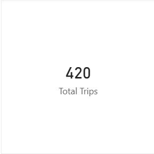

👉 **Insight:**  
Foram registradas 420 viagens no período analisado, o que fornece uma base consistente para análise de padrões e comportamento.

---

### Distância Total Percorrida
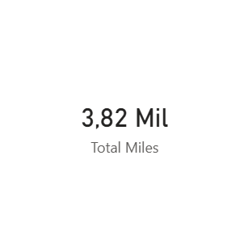

👉 **Insight:**  
O total de 3,82 mil milhas indica um volume significativo de deslocamento.

---

### Duração Média das Viagens
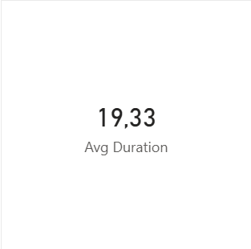

👉 **Insight:**  
A duração média de aproximadamente 19 minutos sugere viagens curtas, típicas de deslocamentos urbanos.

---

## 📊 Análises por Categoria e Tempo

### Viagens por Categoria
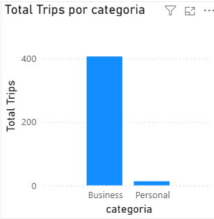

👉 **Insight:**  
Predominância clara de viagens do tipo **business**, indicando uso profissional.

---

### Evolução de Viagens ao Longo do Tempo
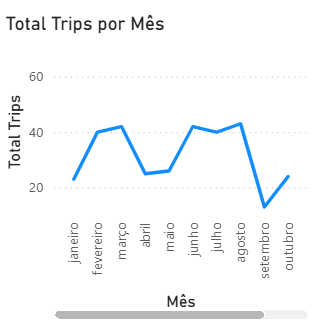

👉 **Insight:**  
Existe variação ao longo dos meses, indicando possível sazonalidade.

---

## 📊 Análises por Finalidade

### Duração Média por Finalidade
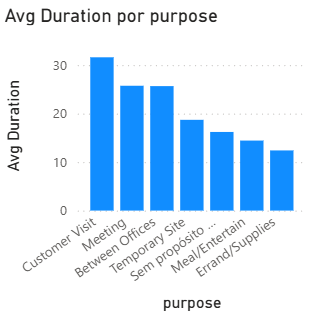

👉 **Insight:**  
Visitas a clientes apresentam maior duração média.

---

### Quantidade de Viagens por Finalidade
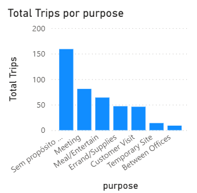

👉 **Insight:**  
“Sem propósito” possui maior volume, indicando possível problema de categorização.

---

## 📊 Análise Temporal

### Viagens por Dia da Semana
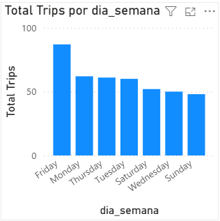

👉 **Insight:**  
Maior volume em dias úteis, especialmente sexta-feira.

---

### Viagens por Período do Dia
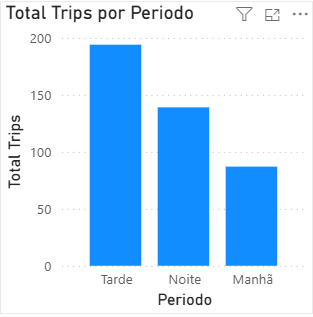

👉 **Insight:**  
A tarde concentra mais viagens.

---

### Duração Média por Período
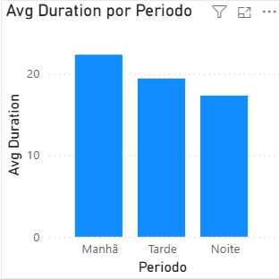

👉 **Insight:**  
A manhã apresenta maior duração média.

---

## 📊 Análise por Localização

### Distância Média por Local de Origem
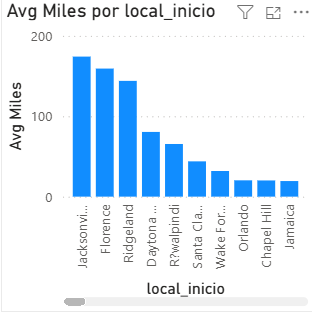

👉 **Insight:**  
Locais com menor frequência podem ter viagens mais longas.

---

### Quantidade de Viagens por Local de Origem
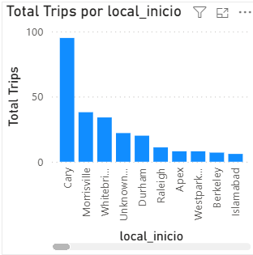

👉 **Insight:**  
Alguns locais concentram grande volume de viagens.

---

## 🧠 Conclusão

- Predominância de uso profissional  
- Maior volume à tarde  
- Viagens mais longas pela manhã  
- Concentração geográfica de uso  

---

## 🚀 Tecnologias Utilizadas

- Python (ETL)  
- PostgreSQL (Data Warehouse)  
- Power BI (Dashboards)
